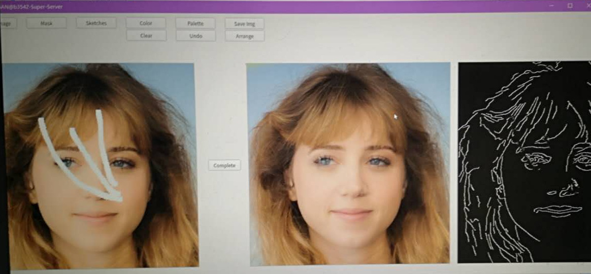

# edge-connect-ui
An image-inpainting application forked from [EdgeConnect](https://github.com/knazeri/edge-connect)

Paper: https://arxiv.org/abs/1901.00212

UI codes forked from [SC-FEGAN](https://github.com/JoYoungjoo/SC-FEGAN)

**Environments:**
- Python 3.6
- Pytorch 1.0.1
- PyQt5
- Numpy, Scipy, Skimage...

**Pretrained model:**

Download from https://github.com/knazeri/edge-connect#getting-started

Put them under `weights/` directory

**How to run:**
```python
python3 demo.py
```

**Testing Samples:**





